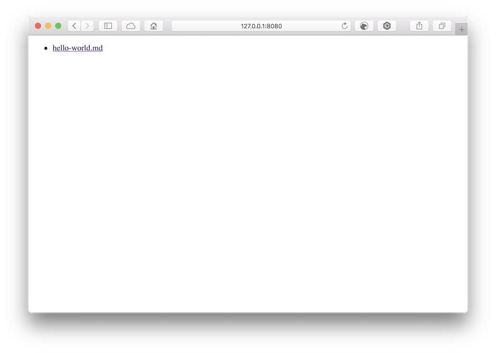
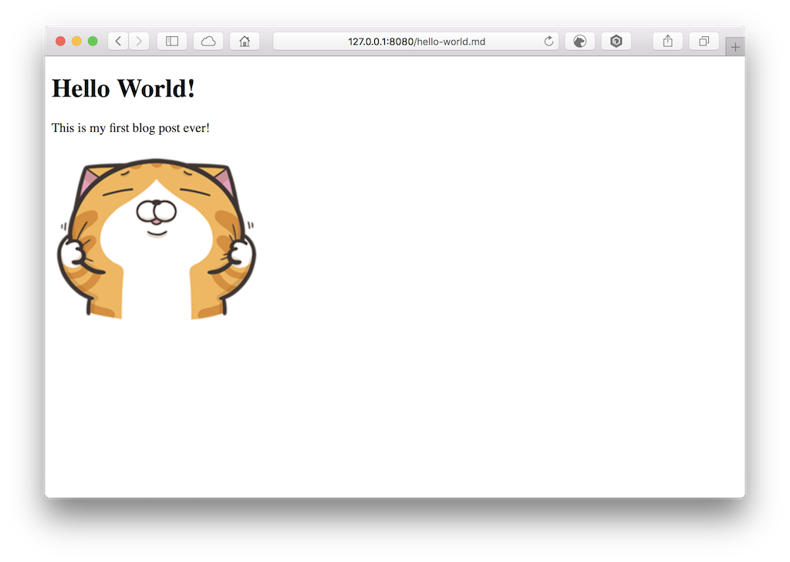

# \[Go][Example] ReadMarkdown

This exmaple present that how to read a markdown file and parse it to html format with Go.

Soource code and reference: [Creating a simple Markdown Blog with Go and Gin](https://jonathanmh.com/creating-simple-markdown-blog-go-gin/)

